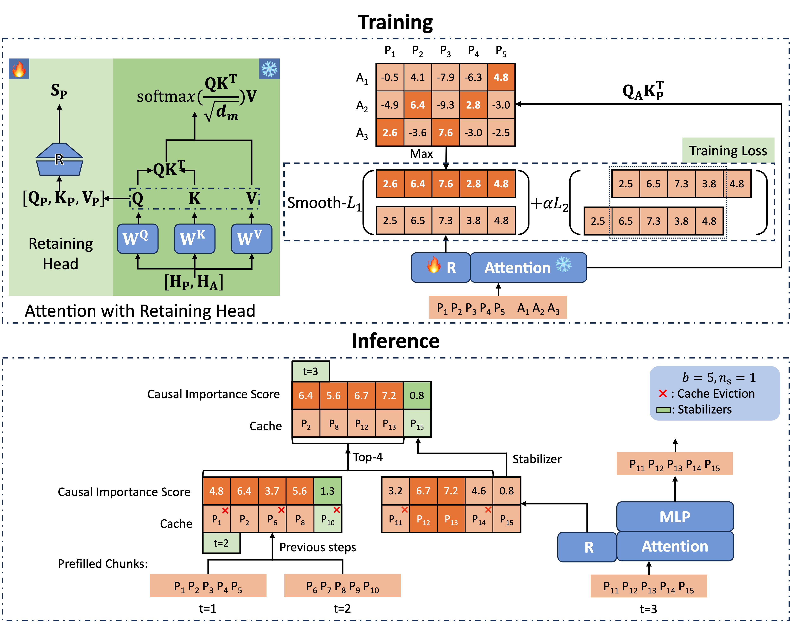

# Locret: Enabling Long-Context Inference on Personal Devices
2024/09 Yuxiang Huang @Tsinghua & HKUST

**TL;DR:** We introduce **Locret**, a light-weight training-based KV cache compression method conducted by chunked prefill along with cache eviction. Locret achieves $20\times$ and $8\times$ KV cache compression ratio compared to the full cache for Phi-3-mini-128K and Llama-3.1-8B-instruct, respectively, with only <1 GPU hours training. Locret is robust and can be combined with multiple efficient inference approaches. To the best of our knowledge, Locret is the first framework capable of deploying Llama-3.1-8B or similar models on a single Nvidia 4090 GPU, enabling 128K long-context inference without compromising generation quality, and requiring little additional system optimizations.

<!-- <div id="framework" style="text-align: center;">
  
  <figcaption>Figure 1: The framework of Locret.</figcaption>
</div> -->


## Background

### Consumer-Grade Devices, End-Side LLMs and Long-Context Inference

### Existing Efficient Inference Approaches

### Inference Complexity

## Locret

### Training to Evict

### Inference with Retaining Heads


## Budget-Constrainted Long-Context Inference

## Acknowlegement

We gratefully appreciate the following indivisuals for there contribution. Without them, this project would be impossible to conduct.

- [Binhang Yuan](https://binhangyuan.github.io/site/) (Prof. @HKUST) The advisor of this project during Yuxiang's internship at HKUST.
- [Xu Han](https://thucsthanxu13.github.io/) (Research Prof. @Tsinghua) and [Zhiyuan Liu](https://nlp.csai.tsinghua.edu.cn/~lzy/) (Prof. @Tsinghua) The advisors from THUNLP lab, who provided so much useful assists and valuable opinions.
- [Chaojun Xiao](https://xcjthu.github.io/) (PhD Stu. @Tsinghua) The author of InfLLM, who provided valuable advices and proofread the paper. 
- [Ruisi Cai](https://cairuisi.github.io/) (PhD Stu. @UT Austin) The author of LoCoCo, who offered aid to training LoCoCo and provided suggestions on extending LoCoCo to Llama-3.1 series.
- [Xinrong Zhang](https://scholar.google.com/citations?hl=en&user=IvTrgR0AAAAJ) (PhD Stu. @Tsinghua) The author of InfiniteBench, who provided insights of the original design of the benchmark InfiniteBench.
- [Weilin Zhao](https://achazwl.github.io/), [Chenyang Song](https://scholar.google.com/citations?user=4L39cy0AAAAJ&hl=en&oi=ao), [Shuo Wang](https://scholar.google.com/citations?user=5vm5yAMAAAAJ&hl=en&oi=ao) and [Yuan Yao](https://yaoyuanthu.github.io/) for valuable discussions.

## Citation

Please refer to our ArXiV [paper](TODO).

```
@article{huang2024locret,
  title={Locret: Accelerating Long-Context LLM Inference with Retaining Heads},
  author={Yuxiang Huang, Binhang Yuan, Xu Han, Chaojun Xiao, Zhiyuan Liu},
  journal={arXiv preprint arXiv:TODO},
  year={2024}
}
```